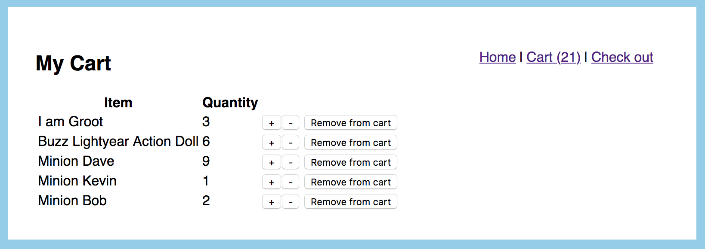
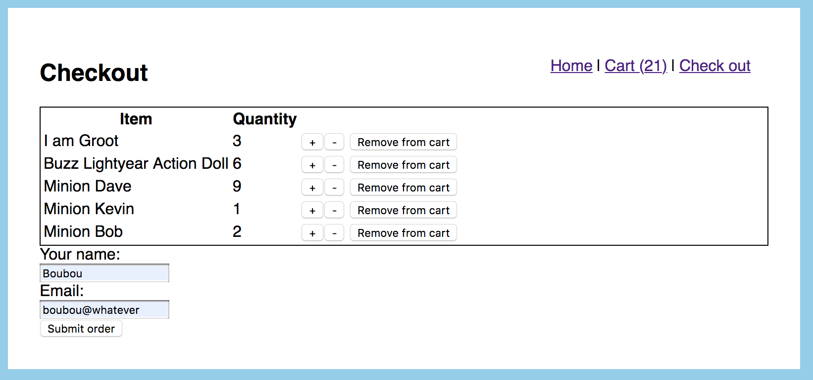
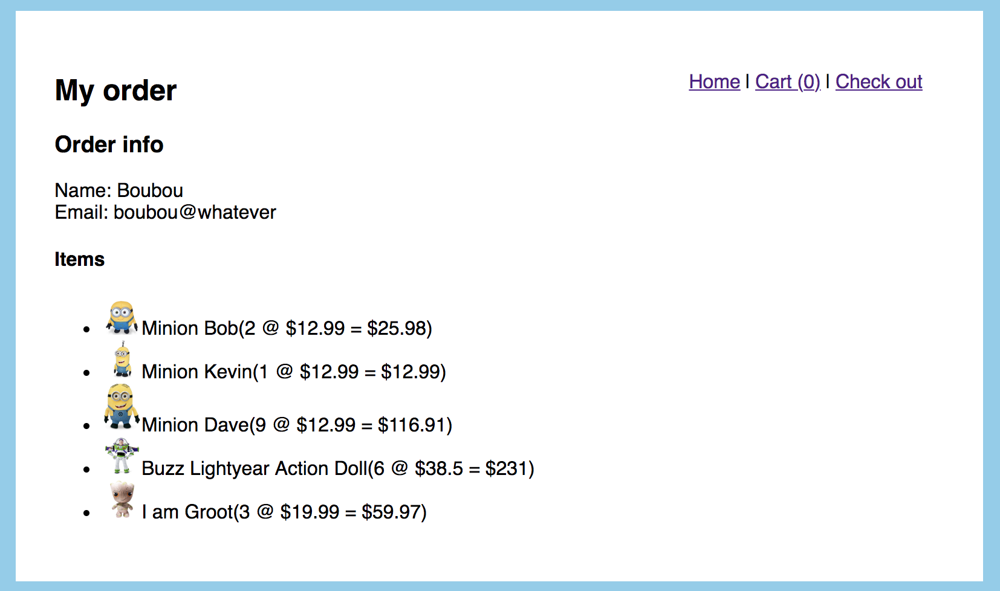

# :department_store: Fake online store :department_store:

## New Technologies used:

- es6-promise
- isomorphic-fetch
- redux-form

## Previews:








## How to run it:

- General Use:

```
git clone git@github.com:GBouffard/fake-online-store.git
cd fake-online-store

yarn install
yarn start
```
